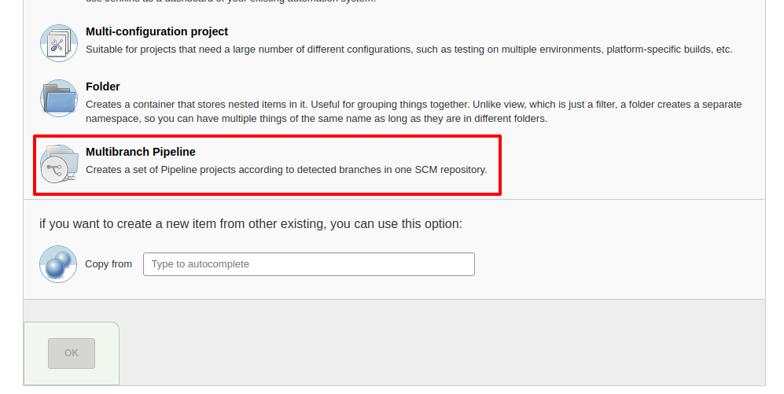
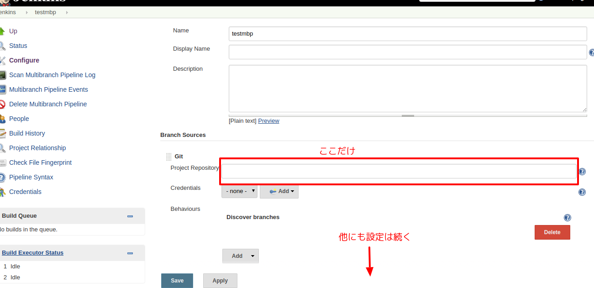

% 今更RailsのテストをDockerで
% ka
% 2017-10-29

# Author

ka

[](https://gravatar.com/ka000)

Website: [kaosfield](http://www.kaosfield.net)

Twitter: [ka](https://twitter.com/ka_)

GitHub: [kaosf](https://github.com/kaosf)

# License

[](http://creativecommons.org/licenses/by-nc-sa/4.0/)

Copyright (C) 2017 ka

# このページとリポジトリ

[https://kaosf.github.io/20171029-tokushimarb-slide](https://kaosf.github.io/20171029-tokushimarb-slide)

Repository: [kaosf/20171029-tokushimarb-slide - GitHub](https://github.com/kaosf/20171029-tokushimarb-slide)

# 内容

<ul>
<li>Jenkins 7割</li>
<li>Docker 3割</li>
</ul>

Dockerの方にコマンド色々書いてありますが

実験 → スライド修正 → 実験方法修正 → …

などとひたすら繰り返していたのでミスがある可能性が高いです…

100%を目指す前にまずはアップしたのであしからず…(明らかなミスとかありましたらIssueを投稿して下さればありがたいです)

# Jenkins Multibranch Pipeline

Jenkinsで新規にジョブを作る際に選択できる候補の一つ

※正確にはジョブではなくアイテムかも

リポジトリに存在するJenkinsfileに反応してブランチごとにジョブを分けて作ってくれる

※Jenkinsfileというファイル名は任意に指定可能だが変える意味は無いと思う



# 設定項目

GitリポジトリのURL

```
git@bitbucket.org:owner/repos.git
```

などを1つ設定するだけ

#



#

必要最小限感が良い

他にも色々設定出来ることはあるがGUIでポチポチやりたくない

設定を保存するとリポジトリをスキャンし始める(既にJenkinsfileがあればビルドを始める)

# それ以前の初期設定

Jenkinsユーザで秘密鍵と公開鍵のペアを作っておく必要がある

```sh
sudo su - jenkins

ssh-keygen

cat ~/.ssh/id_rsa.pub
```

ここで得られた公開鍵をGitHubやBitbucketのリポジトリごとの設定に存在する場所に設定する

※BitbucketならAccess keyに登録 等

もしくは何か別の方法で認証をクリアするとか…あまり色々な方法は知らない(それをまとめた発表聞きたい)

#

あと初回接続時は

```
~/.ssh/known_hosts
```

にGitHub等のサーバ自体の公開鍵？(この辺原理をよく知らない)を登録するかどうかみたいなの聞かれるので一度だけ手動で


```sh
git clone git@bitbucket.org:owner/repos.git
```

しておいてプロンプトに yes と答えておく必要があったかもしれない

#

もしくは

```
~/.ssh/config
```

に

```
host github.com
  StrictHostKeyChecking no
host bitbucket.org
  StrictHostKeyChecking no
```

と設定してやれば大丈夫だった気がする

#

この辺も含めてフルオートにしたいですね

Jenkinsサーバのprovisioningするときに頑張れば出来ますが私はまだやってません

そのうちItamaeのコードスニペットでも雑に作ってGist辺りに保存しておくかも

# 連携設定

Jenkinsのビルドを外部から起動する方法は設定の **Trigger builds remotely** を有効にして推測不能なtokenを設定し外部から

```
http://JENKINS_HOST/buildByToken/build?job=JOBNAME&token=TOKEN
```

にGETリクエストを飛ばしてやることだった

これで普通のジョブは出来ていた(他にも方法はある)

#

Multibranch Pipelineの設定画面にはそういうのが無い

デフォルトで **Poll SCM** になっていると思われる

なので出すべきGETリクエストは以下のようなものになる

```
http://JENKINS_HOST/git/notifyCommit?url=git@bitbucket.org:owner/repos.git
```

これで勝手に更新のあったブランチを検出して動いてくれる

# Jenkinsfileの書き方

Scriptedな書き方とDeclarativeな書き方がある

Declarativeな書き方のほうが後から出来るようになったので世の中に散らばっているサンプルはScriptedの方が多いので困る

おおよそ次のようになる

#

```groovy
#!groovy

pipeline {
    agent any

    stages {
        stage('Build') {
            steps {
                sh 'echo "build"'
            }
        }
        stage('Test') {
            steps { sh 'echo "test"' }
            post {
                always { sh 'echo "finish"' }
                success { sh 'echo "success"' }
                failure { sh 'echo "failure"' }
            }
        }
        stage('Deploy') {
            when {
                branch 'release'
            }
            steps { sh 'echo "deploy"' }
        }
    }
}
```

# 関数説明

```
sh 'command'
```

任意のシェルスクリプトが実行出来る

これで基本的には自由になれる

# 関数紹介

```
archiveArtifaces
```

アーカイブが作れる

## 使い方

```
archiveArtifaces artifacts: 'path/to/flie', fingerprint: true
```

# 関数紹介

```
withCredentials
```

秘密の文字列をログから隠せる

#

## withCredentialsの使い方

KeyName というキーでSecret textを設定している場合

```groovy
withCredentials([string(credentialsId: 'KeyName', variable: 'token')]) {
    sh "echo $token"
}
```

Groovyの通常の変数展開とは違う点に注意

```groovy
"This is ${x}." // 通常
"This is $token // ${} ではなく $ だけにする
```

#

これで今までJenkinsの管轄下にあったジョブの設定がリポジトリ内のテキストファイルとして管理できるようになった

一般のCIサービスのようになってうれしい(TravisCIとか)

# Jenkinsの便利Plugin紹介

便利と言うか必須になってしまったプラグイン

**Role-based Authorization Strategy**

ジョブごとに権限を設定出来る

これが無いともう無理

正規表現を使って複数のジョブにまとめて同じ設定を適用することも出来る

# MultibranchじゃないPipelie

別にブランチごとに反応しなくてもmasterだけでいい…

と思っていて普通のPipelineというものもあるのでそれを最初調べていた

がmasterだろうが何だろうがおかまいなく反応してしまった

処理を分岐しようと色々試したが上手く行かなかったので使うのをやめた

# 未調査

コミットコメントに

```
[ci skip]
```

が含まれていればstageを全て飛ばして成功扱いにするというのをやりたいがやり方不明

# Docker準備

Dockerのインストールは一度インストールに成功したコマンドを控えたりせずに常に公式のガイドを参考にしよう(戒め)

今はこれ

[https://docs.docker.com/engine/installation/linux/docker-ce/ubuntu](https://docs.docker.com/engine/installation/linux/docker-ce/ubuntu)

Docker CEとDocker EEに分裂したがCE (Community Edition)の方を使えば良い

#

Linux Ubuntu 16.04 amd64の場合(現状)

```sh
sudo apt-get update
sudo apt-get install apt-transport-https ca-certificates curl software-properties-common
curl -fsSL https://download.docker.com/linux/ubuntu/gpg | sudo apt-key add -
sudo add-apt-repository \
  "deb [arch=amd64] https://download.docker.com/linux/ubuntu $(lsb_release -cs) stable"
sudo apt-get update
sudo apt-get install docker-ce
```

# sudo無しでもいいように

jenkinsユーザがsudoなしでもdockerコマンドが叩けるようにsudo出来るユーザで以下を実行しておく

```sh
sudo gpasswd -a jenkins docker
```

この後JenkinsなりOSなり再起動する必要があったような気がする

```sh
sudo systemctl restart jenkins.service # ?
# or
sudo shutdown -r now # ?
```

# docker-compose

ここを参考に

[https://docs.docker.com/compose/install/#install-compose](https://docs.docker.com/compose/install/#install-compose)

```sh
sudo curl -L https://github.com/docker/compose/releases/download/1.16.1/docker-compose-`uname -s`-`uname -m` -o /usr/local/bin/docker-compose
sudo chmod +x /usr/local/bin/docker-compose
```

# --linkオプションの代わり

コンテナ同士で連携するための--linkオプションが非推奨になっていたのでnetworkを作ってそれを使う

次のページで例示

#

```sh
docker network create mynetwork

docker run -d --rm --network mynetwork --name mydb postgres:9.6
git clone https://github.com/kaosf/20171029-tokushimarb-rails
cd 20171029-tokushimarb-rails
docker run -t --rm --network mynetwork -e DATABASE_URL=postgres://postgres:@mydb:5432/a \
  -v $PWD:/app -w /app ruby:2.4.2 /bin/bash -c \
"bundle install --path vendor/bundle --without development production &&
RAILS_ENV=test bin/rails db:setup &&
RAILS_ENV=test bin/rake"
```

これでrubyのコンテナからはホスト名 mydb でpostgresのコンテナを参照出来る

DBの名前は所詮作り捨てにするので超適当に a としている

環境変数DATABASE_URLを使えるようにconfig/database.ymlを改造しておくと良い

# 後始末

```sh
docker stop mydb
docker network rm mynetwork
```

mydbの方は--rmオプションを付けていたので止めれば消える

# docker-composeを使う

```
docker-compose.yml
```

というファイル名で次のようなファイルを用意(リポジトリのルートに)

#

```yml
version: '3'
services:
  db:
    image: postgres:9.6
  test:
    image: ruby:2.4.2
    volumes:
      - ./:/app
    environment:
      DATABASE_URL: postgres://postgres:@db:5432/a
    working_dir: /app
    depends_on:
      - db
    command: |-
      /bin/bash -c \
      "sleep 1
      bundle install --path vendor/bundle --without development production &&
      RAILS_ENV=test bin/rails db:setup &&
      RAILS_ENV=test bin/rake"
```

# 若干の注意

docker-composeを使わない方の例では **mydb** だったものを **db** に変更している

※3行目のdbをmydbに変えてDATABASE_URLも変えれば同じになる

# sleepの謎

何故か

```
sleep 1
```

を挟まないとDBへの接続で失敗する…

これが謎

# 動かし方

```sh
docker-compose run test
```

# 後始末

```sh
docker-compose stop
docker-compose rm -f
```

# 未調査

ネットワークがdockercompose_defaultになってしまい同時に起動したときにエラーになるかも

# therubyracerを使うようにしておく

Railsのデフォルト状態で行こうとするとJavaScriptのランタイムがありませんというエラーに遭遇するはず

Gemfileでtherubyracerがコメントアウトされていると思うので有効にしておくと良い

# ガチでDockerのイメージを固定する方法

※jqコマンドをインストールしなくてもJSONを読み解けばいいです

```sh
docker inspect user/container | jq '.[0].RepoDigests[0]'
```

これで出てくる文字列

```
user/container@sha256:0123456789abcdef0123456789abcdef0123456789abcdef0123456789abcdef
```

を指定してpullすればいい

```sh
docker pull user/container@sha256:0123456789abcdef0123456789abcdef0123456789abcdef0123456789abcdef
```

#

ただしタグが付かないので自分で適当に付ければよい

そのためにはイメージIDを知っておく必要がある(docker imagesコマンドで分かる)

```sh
docker images # 調べる
docker tag user/container:myfixedversion1 0123456789ab
```

後は普通に使えば良い

例:

```sh
docker run --rm -it user/container:myfixedversion1 /bin/bash
```

# Tips

手軽に一意な文字列が欲しい場合

```
cat /proc/sys/kernel/random/uuid
```

これでUUIDが得られるので簡単

uuidgenコマンドは無い環境もあった

上手いことネットワーク名やDB名を被らないようにするのに使えそう

# 参考

<ul>
<li>[https://docs.docker.com/compose/](https://docs.docker.com/compose/)</li>
</ul>

## コンテナ同士の連携 (--linkの代替)

<ul>
<li>[https://qiita.com/tamanobi/items/8b8dd64ae1f959f9ff9f](https://qiita.com/tamanobi/items/8b8dd64ae1f959f9ff9f)</li>
<li>[https://scrapbox.io/odiak/docker_%E3%81%AE_--link_%E3%82%AA%E3%83%97%E3%82%B7%E3%83%A7%E3%83%B3%E3%81%AE%E4%BB%A3%E3%82%8F%E3%82%8A](https://scrapbox.io/odiak/docker_%E3%81%AE_--link_%E3%82%AA%E3%83%97%E3%82%B7%E3%83%A7%E3%83%B3%E3%81%AE%E4%BB%A3%E3%82%8F%E3%82%8A)</li>
</ul>

## イメージのdigestを指定してのpull

<ul>
<li>[https://stackoverflow.com/questions/25445318/docker-how-do-i-pull-a-specific-build-id](https://stackoverflow.com/questions/25445318/docker-how-do-i-pull-a-specific-build-id)</li>
<li>[https://docs.docker.com/engine/reference/commandline/pull/#pull-a-repository-with-multiple-images](https://docs.docker.com/engine/reference/commandline/pull/#pull-a-repository-with-multiple-images)</li>
</ul>
